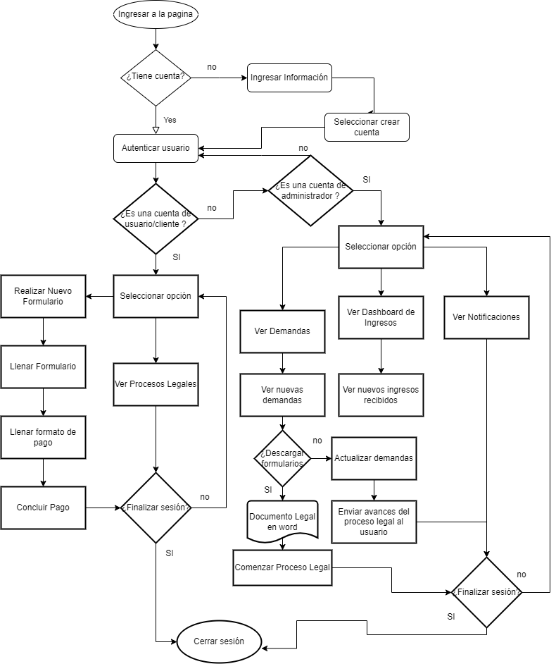

# CASO: ABOGABOT
### TOMA DE REQUERIMIENTOS:

Se realizara una pagina web la cual automatizando las demandas permitira ahorrar tiempo en el llenado de solicitudes.
#### CLIENTE
   * A traves de una pagina web llenara un formulario
   * Realizara un proceso de pago(esto finalizara la transaccion despues del formulario)
   * Creara una cuenta en la plataforma
   * Prodra ver el seguimiento de las actualizaciones del proceso legal
   * Recibira notificaciones(para conocer el avance de su proceso por correo)
   * Colores azul marino y blanco

#### ADMINISTRADOR DEL SITIO
* Recibe la notificacion de las demandas
* Agrega actualizaciones de los procesos legales
* Recibe el pago y debe ser capaz de verlo en un dashboard (para ver la cantidad de ingresos)

#### NOTAS
*  La pagina debe ser responsive(para verla desde el celular)
*  Se podria considerar colores colo gris y azul claro
*  Diseño adaptable
*  Creacion de documentos word

#### REQUERIMIENTOS FUNCIONALES
- LLenar formulario
- Realizar proceso de pago
- Creacion de cuenta
- Ver Actualizacion del proceso legal
- Recibir notificaciones
- Ver demandas
- Crear Documentos word
- Ver Dashboard
- Enviar Actualizaciones

#### REQUERIMIENTOS NO FUNCIONALES
- Interfaz responsive: para poder usar desde el celular y colores correspondientes y aptos para la pagina web
- Eficiencia: El tiempo de respuesta para que el administrador pueda tener la informacion de las demandas y los pagos

### DIAGRAMA DE FLUJO

### BUYER PERSONA

### PUBLICO OBJETIVO

### WIREFRAME UX
#### Página Web

####  Acceso a cuenta

#### Nuevo Usuario

####  Usuario
[Wireframe UX Usuario](UX_usu.md)
####  Cliente
[Wireframe UX Cliente](UX_Cliente.md)
### WIREFRAME UI

